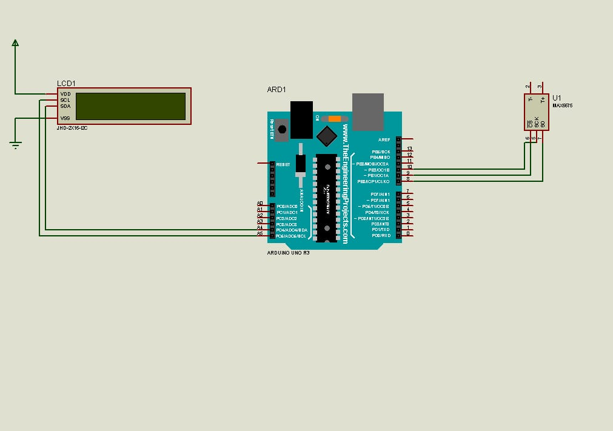
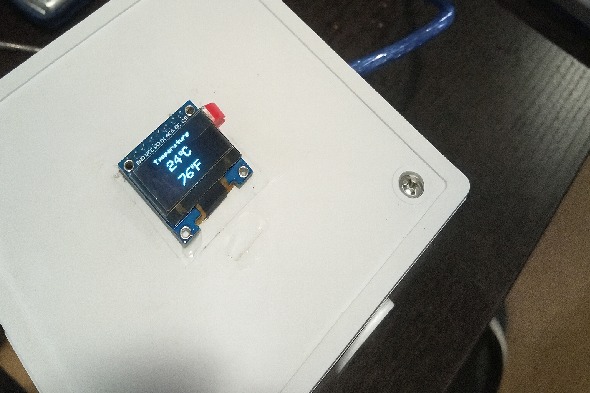

# 🌡 Temperature Measurement Using Max6675 K-type Thermocouple
This repository contains the implementation of the project titled "Temperature Measurement Using Max6675 K-type Thermocouple" at the Department of Mechatronics Engineering (DOME), Federal University of Technology, Minna.

---

## 🕒 Project Overview
Temperature measurement plays an important role across various sectors including industrial process monitoring,  healthcare, agriculture etc. Inaccurate or unavailable temperature readings can lead to damaged goods, wasted resources, and compromised safety. This project focused evaluating the effectiveness of the MAX6675 module K-type thermocouple, in  measuring the temperature of objects (through contact) as well as the surrounding environment. 

---

## 🚀 Project Objectives

- To develop a circuit diagram for integrating the MAX6675 sensor to measure the temperature of objects (both contact and non-contact) and their surrounding environment.
- To measure and record temperature data using the MAX6675 sensor.
- To assess the performance of the MAX6675 thermocouple in comparison with other sensors performing similar temperature-measuring functions.

---
  
## 🧰 Components Used

| **Component**           | **Purpose in the Project**                                                                 |
|-------------------------|---------------------------------------------------------------------------------------------|
| **MAX6675 Module**      | Measured temperature readings from the K-type thermocouple and converted them to digital form. |
| **0.91-inch OLED Display** | Displayed the real-time temperature values clearly on the device.            |
| **Arduino UNO Board**   | Served as the microcontroller responsible for processing sensor data and enabling the display. |
| **Jumper Wires**        | Used for electrical connections between the MAX6675, OLED, and the Arduino board.          |
| **Vero Board**          | Provided a small prototyping platform for organizing the circuit connections.     |
| **10k Resistor**        | Regulated current flow within the circuit to protect components from getting damaged. |
| **Arduino IDE**         | Enabled writing, compiling, and uploading of the program code to the Arduino UNO.            |

## Methodology
As established earlier, the purpose of this projecr was to evaluate the performance of the MAX6675 thermocouple sensor in measuring temperature in its immediate surrounding environment with real-time temperature display on an OLED screen. The sensor’s output was connected to the Arduino UNO micro-controller which then displayed the temperature readings on an OLED screen. The Circuit Diagram for the Setup is shown below:

    
     
    <em> The Circuit Diagram of the Setup</em>

The connection between the components are as follows: 

- Arduino UNO is connected to the OLED display, the MAX6675 and the 10K resistor via 
jumper wires.
- The OLED Display is connected to the Arduino UNO through the I2C bus. 
- The Max6675 is connected to the Arduino UNO though the Analog Pin A0. 
- The 10k resistor is connected between the positive (+ve) and negative (-ve) terminals of 
the thermocouple sensor. 

### Working Principle of the Setup 

The setup starts by measuring the temperature of its surrounding with the aid of the MAX 6675 thermocouple (sensor) afterwhich it sends a voltage signal proportional to the read temperature value via an analog pin (A0) to the Arduino microcontroller. The controller then reads the signal from the analog pin via an analog to digital converter (ADC) into a digital signal which is converted by the use of calibration into relative temperature reading. This value is then sent the OLED screen for display. A resistor is added to help regulate the current within the circuit.

    
     
    <em> Picture of the Setup</em>

## Performance Evaluation
To evaluate the effectivess of the setup
- Temperature values were recorded at specific time intervals to access the accuracy and responsiveness of the setup.
- 
